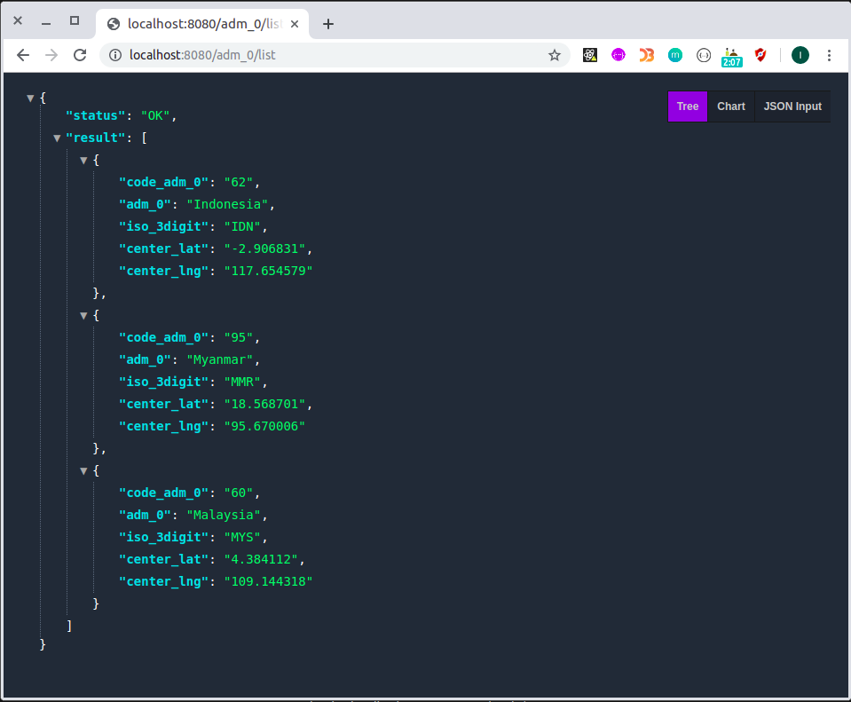

# Docker Service Geo

This is a docker for geo service.

## Get it up and running

- [Install docker.](https://docs.docker.com/install/)

- [Install docker-compose.](https://docs.docker.com/compose/install/)

- Clone this repository.

``` bash
$ git clone https://gitlab.com/qlue-backend/docker-service-geo.git
```

- Switch to the cloned directory.

``` bash
$ cd docker-service-geo
```

- Start the stack.

``` bash
$ docker-compose up
```

- Visit `localhost:8080/adm_0/list` in browser. You should see an output like this.




